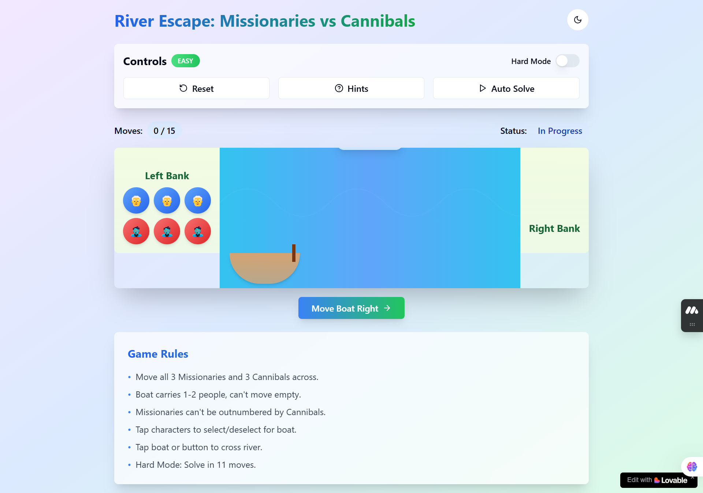

# 🚣‍♂️ River Escape: Missionaries vs Cannibals

A classic logic puzzle game implemented as an interactive web application.

## 🎮 Play Now

Try the game here: [River Escape Puzzle](https://riverpuzzle.netlify.app/)

## 🎯 Game Objective

Help 3 missionaries and 3 cannibals cross a river using a boat that can carry at most 2 people. The catch? Missionaries can never be outnumbered by cannibals on either bank, or they'll be eaten! 

## 🔑 Key Features

- 🎨 Beautiful, responsive design that works on all devices
- 🌓 Dark/Light mode support
- 🤖 Auto-solve feature to see the solution
- 💡 Hint system for guidance
- 🎚️ Two difficulty modes (Easy/Hard)
- 🎵 Smooth animations and transitions

## 🚀 Technologies Used

- ⚛️ React
- 🎨 Tailwind CSS
- 📦 Vite
- 🔷 TypeScript
- 🎭 Shadcn UI

## 👨‍💻 Created By

Lucky Yaduvanshi
- [GitHub](https://github.com/LuckyYaduvanshi5)
- [Portfolio](https://luckyyaduvanshi5.github.io/Portfolio/)

## 🧩 More Puzzle Games

Check out my other puzzle implementations:
- [Water Jug Puzzle](https://luckyyaduvanshi5.github.io/WaterJugPuzzle/)
- [Monkey Banana Puzzle](https://luckyyaduvanshi5.github.io/MonkeyBananaPuzzle/)

## 🌐 Project Info

**URL**: https://riverpuzzle.netlify.app/

## 🛠️ Development

To run this project locally:

\`\`\`sh
# Clone the repository
git clone <repository-url>

# Install dependencies
npm install

# Start development server
npm run dev
\`\`\`

## 📜 License

MIT © Lucky Yaduvanshi

